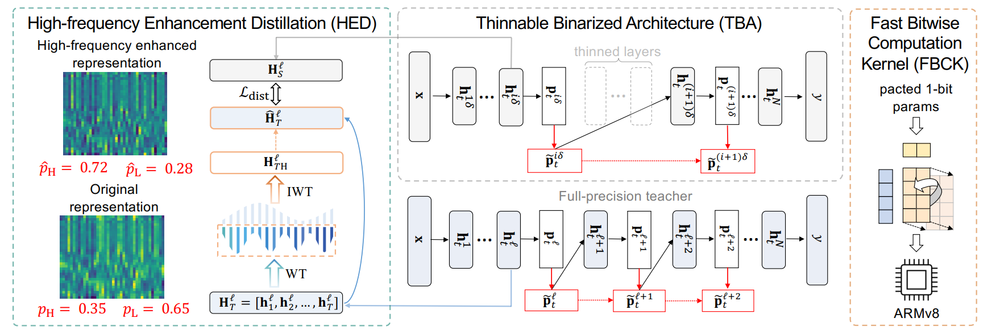

# *BiFSMN: Binary Neural Network for Keyword Spotting*

The code for [BiFSMNv2](https://github.com/htqin/BiFSMNv2) is [here](https://github.com/htqin/BiFSMNv2)! It can greatly improve the performance of BiFSMN.

Created by [Haotong Qin](https://htqin.github.io/), Xudong Ma, [Yifu Ding](https://yifu-ding.github.io/), Xiaoyang Li, Yang Zhang, Yao Tian, Zejun Ma, Jie Luo, and [Xianglong Liu](https://xlliu-beihang.github.io/) from Beihang University and Bytedance AI Lab.



## Introduction

This project is the official implementation of our accepted IJCAI 2022 paper *BiFSMN: Binary Neural Network for Keyword Spotting* [[PDF](https://www.ijcai.org/proceedings/2022/0603.pdf)]. The deep neural networks, such as the Deep-FSMN, have been widely studied for keyword spotting (KWS) applications. However, computational resources for these networks are significantly constrained since they usually run on-call on edge devices. In this paper, we present **BiFSMN**, an accurate and extreme-efficient binary neural network for KWS. We first construct a *High-frequency Enhancement Distillation* scheme for the binarization-aware training, which emphasizes the high-frequency information from the full-precision network's representation that is more crucial for the optimization of the binarized network. Then, to allow the instant and adaptive accuracy-efficiency trade-offs at runtime, we also propose a *Thinnable Binarization Architecture* to further liberate the acceleration potential of the binarized network from the topology perspective. Moreover, we implement a *Fast Bitwise Computation Kernel* for BiFSMN on ARMv8 devices which fully utilizes registers and increases instruction throughput to push the limit of deployment efficiency. Extensive experiments show that BiFSMN outperforms existing binarization methods by convincing margins on various datasets and is even comparable with the full-precision counterpart (e.g., less than 3% drop on Speech Commands V1-12). We highlight that benefiting from the thinnable architecture and the optimized 1-bit implementation, BiFSMN can achieve an impressive $22.3\times$ speedup and $15.5\times$ storage-saving on real-world edge hardware.

## Datasets and Pretrained Models

We train and test BiFSMN on Google Speech Commands V1 and V2 datasets, which can be downloaded in the reference document:

- https://pytorch.org/audio/stable/_modules/torchaudio/datasets/speechcommands.html#SPEECHCOMMANDS

And we also release a pretrained model on Speech Commands V1-12 task for our distillation.

## Execution

Our experiments are based on the fine-tuned full-precision BiFSMN_pre, which can be found [here](?????????????????). Complete running scripts is provided as follow

```shell
python3 train_speech_commands.py \
    --gpu=0 \
    --model=BiDfsmn_thinnable --dfsmn_with_bn \
    --method=Vanilla \
    --distill \
    --distill_alpha=0.01 \
    --select_pass=high \
    --J=1 \
    --pretrained \
    --teacher_model=BiDfsmn_thinnable_pre \
    --teacher_model_checkpoint=${teacher_model_checkpoint_path} \
    --version=speech_commands_v0.01 \
    --num_classes=12 \
    --lr-scheduler=cosin \
    --opt=sgd \
    --lr=5e-3 \
    --weight-decay=1e-4 \
    --epoch=300 \

```

## Citation

If you find our work useful in your research, please consider citing:

```shell
@inproceedings{qin2022bifsmn,
  title     = {BiFSMN: Binary Neural Network for Keyword Spotting},
  author    = {Qin, Haotong and Ma, Xudong and Ding, Yifu and Li, Xiaoyang and Zhang, Yang and Tian, Yao and Ma, Zejun and Luo, Jie and Liu, Xianglong},
  booktitle = {Proceedings of the Thirty-First International Joint Conference on
               Artificial Intelligence, {IJCAI-22}},
  pages     = {4346--4352},
  year      = {2022}
}
```
